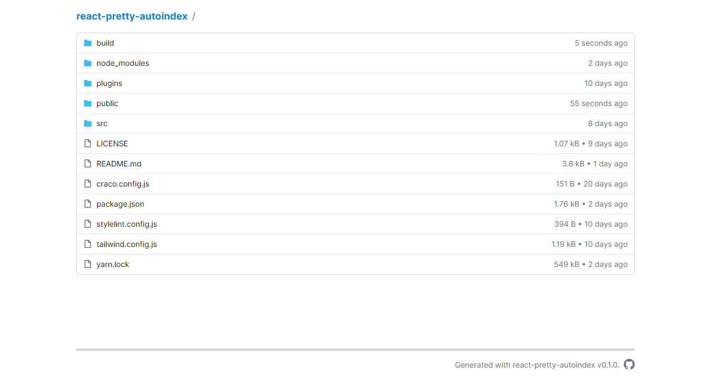

# react-pretty-autoindex

Shows the Nginx autoindex more pretty.



This project is a rewrite from this [other project](https://github.com/spring-raining/pretty-autoindex/) but using [React](http://reactjs.org/) and [Tailwind CSS](https://tailwindcss.com/).

## Installation

First, download the latest release from [GitHub Releases](https://github.com/dalbitresb12/react-pretty-autoindex/releases/latest) to your server. You may also [compile your own version](#development).

**NOTE**: The compiled version is ready to work in subdirectories with no changes **using server-side rewrites and an internal proxy**, but it can also work at the root of a domain or subdomain. **If you don't want to use server-side rewrites**, you must compile your own version and set the `PUBLIC_URL` environment variable in the `.env` file.

Before using it, you need to set some Nginx configurations. (In this example, the hostname used is `example.com`, so you should replace it as necessary).

```nginx
# This generates the API for react-pretty-autoindex to access.
server {
  listen 80;

  server_name files.example.com;
  root /path/to/folder/to/index;
  
  # Set this to something random so that no index is ever matched.
  # You can get something random using this command on a Linux machine:
  # openssl rand -base64 12
  index CPBCTVOyUs1O6kDvAkhKWN3d;

  location / {
    autoindex on;
    autoindex_format json;

    # Enable CORS requests.
    # This also enables CORS preflight.
    add_header Access-Control-Allow-Origin 'example.com';
    add_header Access-Control-Max-Age '300';
    add_header Access-Control-Allow-Methods 'GET, HEAD, OPTIONS';
    add_header Access-Control-Allow-Headers 'Origin, Authorization, Accept';
    add_header Access-Control-Allow-Credentials 'true';
  }
}

# This is the actual server for serving react-pretty-autoindex.
server {
  listen 80;

  server_name example.com;
  root /path/to/react-pretty-autoindex/build/;
  index index.html;

  location / {
    try_files $uri $uri/ /index.html =404;
  }
}
```

Then, set the options you want in the `config.js` and uncomment the last line for the changes to be applied.

```javascript
const config = {
  name: 'react-pretty-autoindex',
  basePath: '/', // base path for react-router, no trailing slash
  address: 'http://files.example.com', // no trailing slash
  withCredentials: false, // include credentials in fetch
  visibilityOptions: {
    size: {
      use: true,
      tooltip: true, // always false if type is set to both
      type: 'readable' // raw, readable, both
    },
    date: {
      use: true,
      tooltip: true, // always false if type is set to both
      type: 'readable' // raw, readable, both
    }
  }
};

Object.freeze(config);
Object.freeze(config.visibilityOptions);
Object.freeze(config.visibilityOptions.size);
Object.freeze(config.visibilityOptions.date);

// Uncomment the following line to use this config instead of the default config
globalThis.config = config;
```

Finally, restart Nginx and access `example.com`.

**CAUTION!** If you intend to open your page in a public network, beware your Nginx configuration and exclude files that you wouldn't like to expose from the directory.

## Configuration Examples

TODO

## Development

To build react-pretty-autoindex:

1. Install [Node.js](https://nodejs.org) and [Yarn 1](https://classic.yarnpkg.com/).

2. Install all the dependencies: `yarn` or `yarn install`.

3. Copy `.env.example` to `.env`.

4. Run the build command: `yarn build`.

To start the development server, just run `yarn start` and then open [`localhost:3000`](http://localhost:3000).

## License

This repository is licensed under the [MIT license](LICENSE).
